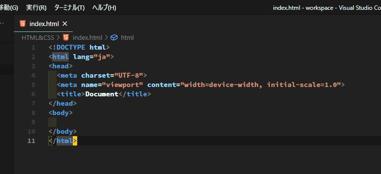

## ファイルを作成する

今回の目的は、HTMLファイルを作成、実行しブラウザ上でページを表示させることです。

早速、作業フォルダを作成します。デスクトップに「workspace」という名前のフォルダを作成、その中に「HTML&CSS」フォルダを作成、さらにその中に`index.html`ファイルを作成します。


フォルダ名や作成場所は自由です。好きなように適宜変更して下しさい。
ファイル名の`index`は変更可能ですが、慣習的に`index`が用いられていますので、そう命名することをお勧めします。拡張子である`html`は変更不可です。

## HTMLファイルに内容を空きこむ

では、htmlファイルに表示させたい内容を書き込んでいきます。VSCodeをお使いの方は、1行目に半角の`!`を入力してください。すると以下のようなポップアップが表示されると思います。


続けてShiftキーを押下すると、HTMLファイルのひな型が自動的に作成されます。



上手く動かない、VSCodeを使用していないという方は、以下のコードをコピーして張り付けてください。

```html
<!DOCTYPE html>
<html lang="ja">
<head>
  <meta charset="UTF-8">
  <meta name="viewport" content="width=device-width, initial-scale=1.0">
  <title>Document</title>
</head>
<body>
  
</body>
</html>
```

続けて、9行目、`<body>`と`</body>`の間の行に任意の文字列を入力します。こういう時は「Hello World」と入力すると相場は決まっていますのでそうしてみましょう。

入力が完了したらファイルを上書き保存します。

これでHTMLファイルが完成です。完成したHTMLファイルをダブルクリックして実行してください。もしくは**Live Server**プラグインをインストールしている方は、右下の`Go Live`をクリックしてください。


いずれにせよ、ブラウザが立ち上がり、入力した任意の文字列が表示されていることが確認できるはずです。


おめでとうございます！これもWebページの一種だと言えるでしょう。
Webサーバなど用意しなくても、htmlファイルとブラウザがあればページを表示することは可能です。

## CSSでデザインを整える
