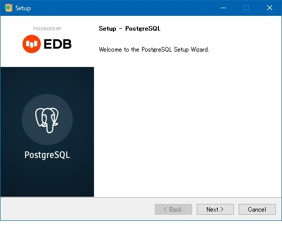
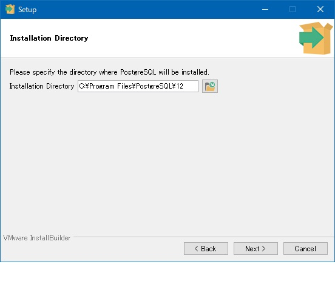
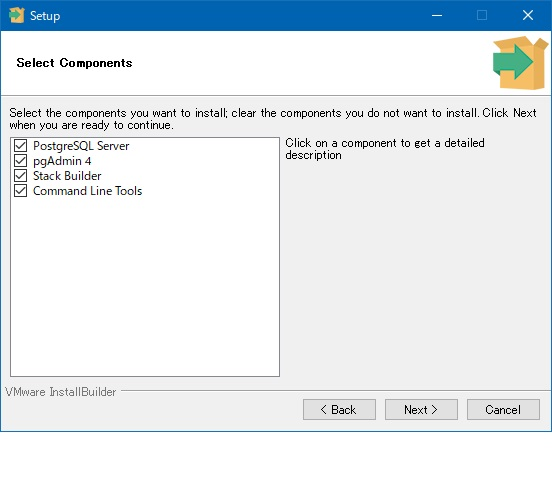
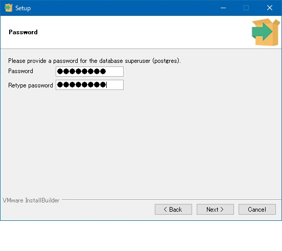
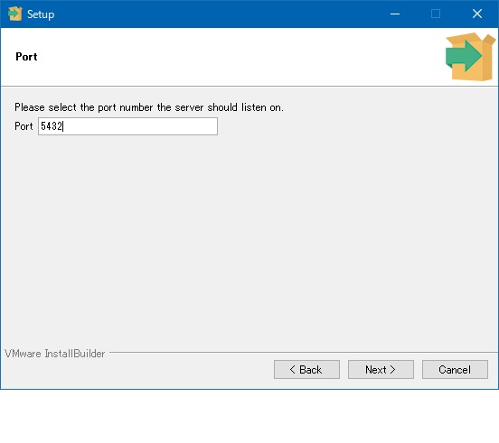
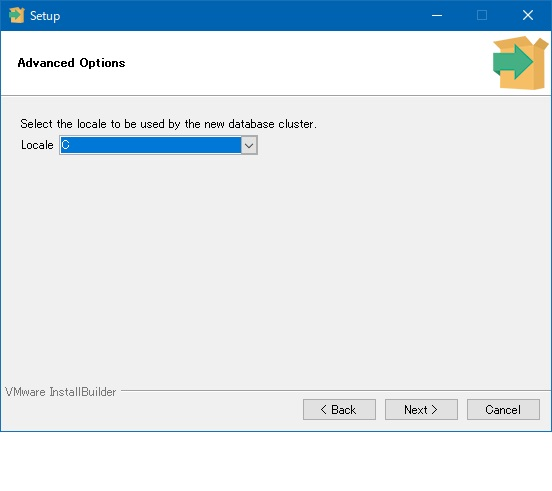
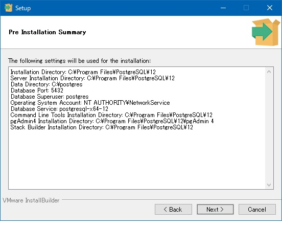
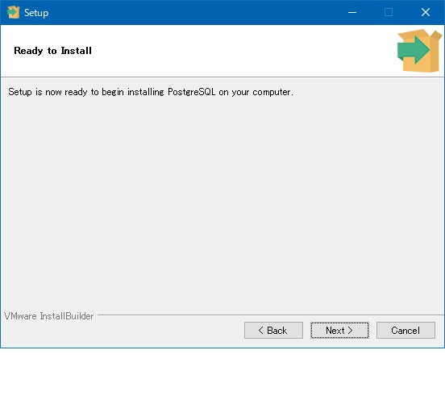
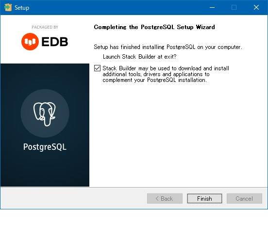
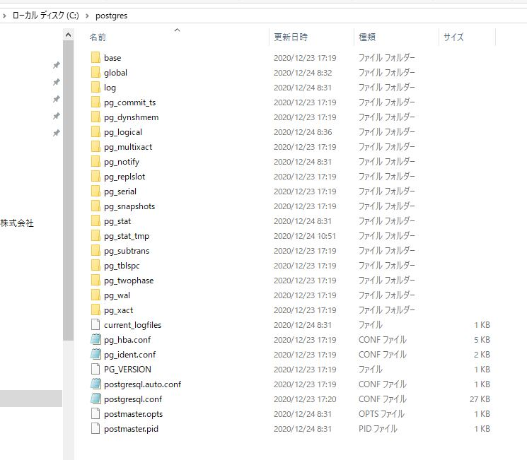

<section class="section">

## インストーラをダウンロードする

[こちら](https://www.enterprisedb.com/downloads/postgresql)からPostgreSQLのインストーラをダウンロードします。

2020年12月現在、13.1のインストーラが用意されているようですが、ここでは12.5のインストーラを落とします。


exeファイルがダウンロードされると思いますので、管理者として実行します。


</section>

<section class="section">

## インストールする

Nextをクリックします。



PostgreSQL本体をインストールする場所を指定します。デフォルトのままがいいと思いますので、このままNextをクリックします。



インストールするコンポーネントを聞かれますので、全てにチェックが入っている状態でNextをクリックします。



続いて、DBデータなどが保存される**クラスタ**の設定場所を聞かれます。デフォルトのままでもいいですが、ここではCドライブの直下に`postgres`フォルダを作成、そこをクラスタとすることにします。


続いて、postgresユーザ（全ての権限をもつスーパーユーザです）のパスワードを設定します。



PostgreSQLサーバが待ち受けるポート番号を指定します。ここではデフォルトのまま、5432を設定します。


続いてロケール（言語、地域設定）を設定します。恐らく`Japanses, Japan`などと表示されていると思いますが、これを変更し`C`を選択することをお勧めします。

`C`はロケールを指定せず、PostgreSQLのデフォルトの設定を適用するという意味です。

ただ、`Japaneses, Japan`ロケールを設定しても、少なくともチュートリアルを進めるうえでは大きな問題にはなりません。

余裕があるならば両方のロケールを設定してみて、どういった違いがあるのかを確認してみるものいいと思います。

ただ、ここではCロケールを設定し、先に進みます。



Nextをクリックします。


Nextをクリックすればインストールが開始されます。







今回はクラスタ作成場所を`C:\postgres`に指定しました。指定した場所にアクセスし、DB関係のファイルがあるかを確認しておきます。

</section>

<section class="section">

## DBプログラムへのパスを通す

PostgreSQLの操作方法は様々ありますが、ここでは主に`psql`コマンドを私用します。
おもむろにコマンドプロンプトを立ち上げ、`psql --versoin`を実行してみます。まだパスを通していないため、恐らく以下のようなエラーが発生すると思います。


`psql`にはpsql.exeという実体があります。
`psql`コマンドを実行することで、「psql.exeを実行してくれー」と命令しているつもりですが、「psqlってなに？どこにあるの？」ということを言っているエラーメッセージです。

psql.exeは


</section>

<section class="section">

# DBのアクセスログを収集する

ある程度、自由にログ出力を行えるようになります。

こちらのページでも紹介しましたが、postgresql.confにおけるログ関係の設定は以下の通りです。

|パラメータ|内容|
|:--|:--|
|log_destination|ログの出力先を指定。デフォルトはstderr|
|logging_collector|標準エラーをファイルに書き出すかどうかを指定|
|log_connections|クライアントの認証、サーバへの接続など、クライアントに関するログを出力するかどうか|
|log_min_messages|出力するログレベルを指定※後述|
|log_line_prefix|ログの行頭にユーザ名やDB名などの情報を付与する|
|log_statement|ログに書き出すSQL文の種類|allなら全てのSQL文を出力|

## クラスタ作成

既に私用している環境を汚すのもいやだと思うので、新しくクラスタを作成します。

```console
$ initdb pgtest

(略)

成功しました。以下のようにしてデータベースサーバを起動することができます:

  pg_ctl -D postgres -l ログファイル start
```

## まずは英文での出力に切り替え

例えばログインメッセージ等、日本語で出力されます。

```shell
c:\postgres>pg_Ctl start -D .
サーバの起動完了を待っています....2020-12-23 14:39:19.256 JST [14524] LOG:  PostgreSQL 12.4, compiled by Visual C++ build 1914, 64-bit を起動しています
2020-12-23 14:39:19.268 JST [14524] LOG:  IPv6アドレス"::1"、ポート5432で待ち受けています
2020-12-23 14:39:19.269 JST [14524] LOG:  IPv4アドレス"127.0.0.1"、ポート5432で待ち受けています
2020-12-23 14:39:19.322 JST [14524] LOG:  ログ出力をログ収集プロセスにリダイレクトしています
2020-12-23 14:39:19.322 JST [14524] ヒント:  ここからのログ出力はディレクトリ"log"に現れます。
完了
サーバ起動完了
```

以下のlc_messagesテーブルを参照することで確認できます。WindowsOSであれば、恐らく以下のようになっていると思われます。

```shell
c:\postgres>psql -d postgres -c "SHOW lc_messages;"
    lc_messages
--------------------
 Japanese_Japan.932
(1 行)
```

そしてpostgresql.confで**lc_messages**を検索すると、以下のようになっていると思われます。

```conf
lc_messages = 'Japanese_Japan.932'			# locale for system error message
```

### log_statement

ログに書き出すSQL文の種類を指定します。

|パラメータ|内容|
|none **デフォルト**|ログを出力しない|
|ddl|データ定義言語（CREATE、DROP、ALTER、TRUNCATE）のログを出力|
|mod|**ddlに加えて**、データ操作言語（SELECT、INSERT、UPDATE、DELETEなど）のログを出力|
|all|全てのSQLログを出力|

INFO…ユーザから出力を要求された情報
NOTICE…ユーザにとって役立つ情報
WARNING…不適切なコマンド使用等に対するユーザへの警告
ERROR…特定のコマンドを中断させたエラー
LOG…データベース管理者にとって役立つ、パフォーマンスや内部の処理に関する情報
FATAL…特定のセッションを中断させたエラー
PANIC…全てのセッションを中断させた致命的なエラー

```conf
log_destination = 'stderr'		# Valid values are combinations of
```

https://lets.postgresql.jp/documents/technical/text-processing/2