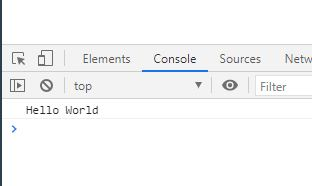
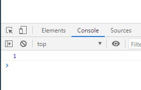

# #1 入門JavaScript(前編)

## JavaScriptとは

JavaScriptはNetscape社によって開発された、ブラウザ上で動作するスクリプト言語です。
HTMLファイルやCSSファイルと共にサーバからダウンロードされ、ブラウザ上で実行されます。

こちらのコンテンツでは、HTMLとCSSという言語でWEBページを作成しました。

それぞれの言語の役割としては、
 - HTML = 文書構造を記述する
 - CSS = デザインを記述する

という風に言えます。

これらに対してJavaScriptは**Webサイトに動きを与える**役割を持っていると言えます。

分かりやすい例を挙げるならば、

 - カウントダウンタイマーを作る
 - ボタンをクリックするとコンテンツが現れる
 - （例えば）オセロゲームを作る

などと言ったところです。

HTMLやCSSは正しくはプログラミング言語ではありません。HTMLはマークアップ言語、CSSはスタイルシート言語と分類されます。

しかし、JavaScriptはれっきとしたプログラミング言語です。

2021年現在、WebサイトはHTML、CSS、そしてJavaScriptの3つの言語で構成されており、JavaScriptはWebサイトの構築のために習得が必須な言語と言えます。
※「～3つで構成されており～」というのは、私たちユーザから見える部分に限った話です。HTML、CSS、JavaScriptで表現される部分を**フロントエンド**などと言ったりします。対して、私たちから見えない部分、例えばショッピングサイトでユーザを作成しその情報を保持する、商品の在庫数を管理するなど、直接見ることができない仕組みを**バックエンド**といいます。このバックエンドを構成するのはPHPやRubyなどと言った言語です。そしてそこにはJavaScriptも含まれています。ただ、HTMLとCSSは含まれていません。JavaScriptはフロントエンドでもバックエンドでも利用されていると憶えておいてください。

なお、どこかで聞いたことのある話だと思いますが、プログラミング言語JavaとJavaScriptは**関係ありません**。名前が似ているだけです。
「Java JavaScript 違い」「JavaScript 歴史」などで検索してみてください。

脱線しますが、**静的なページ**、**動的なページ**といった表現を聞いたことがあるかも知れません。「動きを与えるんだからJavaScriptを使えば動的なページになるんだな」と言われると**そうではありません**。
詳しくは後述しますが、例えば以下のページなどを見てみてください。

[静的ページと動的ページの違いとメリット・デメリット | Webmedia](https://www.itra.co.jp/webmedia/static-dynamic-difference.html)

[静的コンテンツ/動的コンテンツの違いを１分で解説【初心者向け】 | ビズドットオンライン](https://it-biz.online/it-skills/static-dynamic/)

## JavaScriptを学ぶメリット

JavaScriptは、2021年現在、フロントエンド領域を支配しているほぼ唯一のプログラミング言語と言えます。
もしかしたら**React**や**TypeScript**などの言語の名前を知っているかもしれませんが、これらの言語を使用しても最終的にはJavaScriptコードが生成されブラウザ上で実行されることになります。

**React**や**Vue.js**はいわゆるフロントエンドのWebフレームワークというやつです。元となっている言語はJavaScriptであり、実行されるのもJavaScriptコードです。やはりJavaScriptの学習なしにこれらのフレームワークを扱うことはできません。

なお、このブログもJavaScriptを応用した**Gatsby**というフロントエンドWebフレームワークを使用して構築しています。

[gar](https://note.com/erukiti/n/nffdcbfafbabb)

また、Node.jsという**JavaScriptの実行環境**の誕生により、JavaScriptはバックエンド（サーバサイド）でも動作するようになりました。端的に言うと、JavaScriptを使用してデータベースから値を取得し、Webサイトに表示させることが出来るようになったのです。

## 具体的になにを学ぶの？

まず前編ではブラウザ上でJavaScriptのプログラムを動かしてみます。

後編ではNode.jsをPCにインストール、JavaScriptの言語使用について解説します。

## ECMAScriptって何?

**ECMAScript**はJavaScriptの標準仕様の事です。Ecma Internationalという標準化団体の下でECMAScriptの標準化が行われています。

|ECMAScriptのバージョン|リリース時期|
|:--|:--|
|1|1997年6月|
|2|1998年6月|
|3|1999年12月|
|4|破棄|
|5|2009年12月|
|5.1|2011年6月|
|2015|2015年6月|
|2016|2016年6月|
|以後、毎年リリース|

参考：https://jsprimer.net/basic/ecmascript/

2015年にバージョン2015がリリースされました。このバージョンは**ES2015**と呼ばれています（当初は「ES6」と呼ばれていたみたいですが、正式名称はES2015となったようです。ES6表記も見かけますが、多分ES2015の方がメジャーだと思うのでこのブログでもES2015と表記します。）。

ES2015は、それまでJavaScriptの弱点とみなされていた部分が改善された、非常に大きな改正だったと言えます。例えば、let・constを使用しての変数宣言、アロー関数、class構文、Promiseによる非同期処理などが挙げられます。

ES2015の構文に対応していないブラウザもあるようですが、JavaScriptを学習するうえでES2015を学ばない手はありません。2021年1月現在、ECMAScriptはES2020までリリースされていますので、2015~2020の仕様の元、JavaScriptを学習しようと思います。

ES2015以降に追加された新しい構文に関しては、ES〇〇より追加、などと言った形で情報を付与します。

## ブラウザのコンソールに文字を出力する

以下のようなhtmlファイルを用意します。

```html
<!DOCTYPE html>
<html lang="ja">
<head>
  <meta charset="UTF-8">
  <meta name="viewport" content="width=device-width, initial-scale=1.0">
  <title>入門JavaScript</title>
</head>
<body>
  <script src="script.js"></script>
</body>
</html>
```

ポイントはbodyの中の`<script>`タグです。htmlファイルでは`<script>`タグを用い、JavaScriptを利用します。`src=[path]`の記述でJavaScriptファイルを読み込みます。
それではindex.htmlと同じ階層に`script.js`ファイルを用意し、以下のように記述してください。

```javascript
console.log('Hello World');
```

文はセミコロンによって区切られます。行末尾のセミコロンは忘れずに付けるようにしましょう。セミコロンをつけなくてもJavaScriptは自動的に保管してくれるようですが、それは時に思わぬ不具合をもたらします。

以上で準備完了です。index.htmlをダブルクリックしてGoogle Chromeを立ち上げるか、VSCodeを使用している方ならLive Serverプラグインが便利です。

ブラウザを立ち上げても、画面上には何も表示されていないはずです。`cosnoel.log`という命令の結果は、ブラウザのコンソールに出力されます。F12キーを押下し、開発者ツールを開いてください。そしてConsoleタブがあるはずですので、クリックします。



`Hello World`と表示されていたならOKです。今回の解説は終了です。

しばらくの間はこのようにGoogle Chromeのブラウザコンソールに出力して結果を確認したいと思います。

本当はNode.jsをインストールすればもっと簡潔に実行できますがよくわからないものを入れたくないと思いますので、後回しにします。

## 変数を表示させる

 - const [ES2015]
 - let [ES2015]

変数はよく、箱にたとえられます。箱に好きな名前をつけ、好きな数値や文字列を収納、好きな時に引っ張り出して使いまわすことができます。

JavaScriptにおいて変数はconstキーワード、のちに紹介するletキーワードを使用して定義します。

以下の例では、constキーワードを使用し、`age`という名前の変数を宣言、数字の1をage変数に代入しています。

```javascript

const 変数名 = 値;

// 変数ageに数字の1を代入
const age = 1;
```

変数に代入した値を利用する時は、以下のように変数名を記述します。

```javascript
const age = 1;

// 変数ageの値を出力
console.log(age)
```



なお、これより、コンソール上に出力されるメッセージは`// => 出力結果`という形で記載します。

```javascript
const age = 1;

console.log(age)
// => 1
```

変数には文字列も格納することができます。文字列を表現する時はシングルクオート、またはダブルクオートを用います。

```javascript
const name1 = "kento";
const name2 = 'keiko';

console.log(name1);
// => kento

console.log(name2);
// => keiko
```

## 変数を宣言するタイミングは？

変数は、その変数を利用する文（上記例で言うとconsole.log()のところ）よりも前に宣言する必要があります。宣言する前に変数を使用すると、以下のようにエラーが出力されます。

```javascript
console.log(age);
// => Uncaught ReferenceError: Cannot access 'age' before initialization

const age = 1;
```

訳すと、「変数ageには初期化する前にはアクセスできないよー」となります。また詳しく取り上げますが、変数の宣言と初期化に関しては、以下のリンクに簡潔にまとめられています。
[JavaScriptの変数巻き上げという概念](https://qiita.com/hi_zacky/items/2309f0ba6092101ca70e)

## constとletの違い

constを使用して変数に値を代入した場合、後から他の値を代入することはできません。
実際に代入しようとすると、エラーが出力されます。変数の値を上書きするようなことはできないという訳です。

```javascript
const age = 1;

// 再度代入しようとしている
age = 2;
// => Uncaught TypeError: Assignment to constant variable.
```

再代入する可能性がある変数を宣言する時は、letキーワードを用います。

```javascript

let name = "kento";

// 再代入できる
name = "keiko";

console.log(name);
// => keiko
```

constとletはどちらかに優劣が付くものではありません。letは後から値を書き換えられるため便利そうですが、「意図しないところで勝手に値が下記変わってしまう可能性がある」とも言えます。

変数宣言は基本的にconstを用い、再代入が必要な時だけletを使用する、と憶えておけば間違いないと思います。

## 式と文
