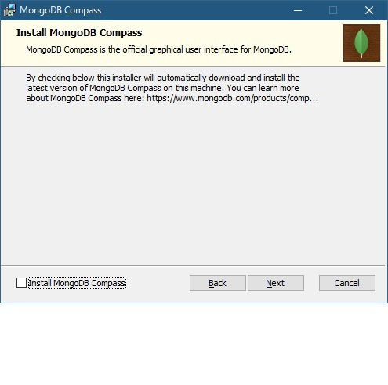
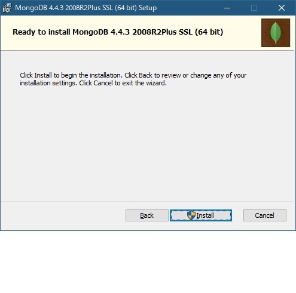
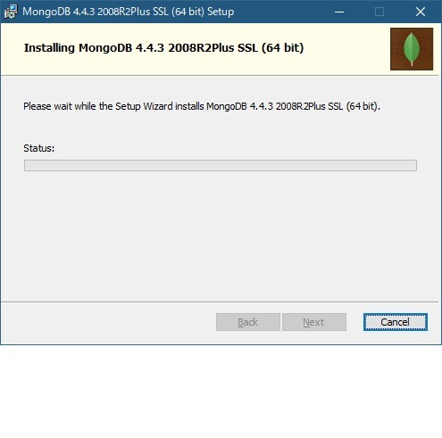
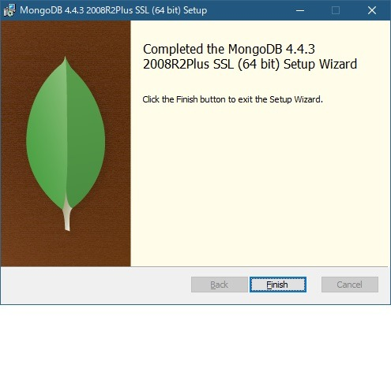
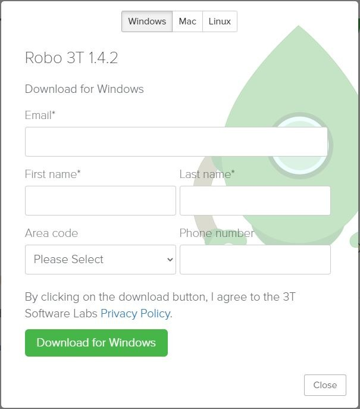
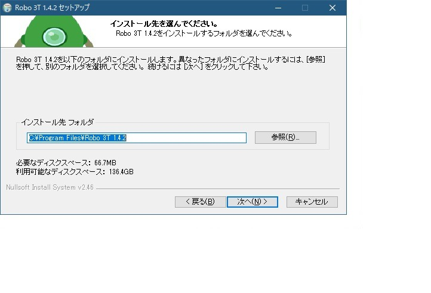

[こちら](https://www.mongodb.com/try/download/community)にアクセスし、**MongoDB Community Server**を選択します。


下記の通り、ダウンロードするバージョン等を選択できます。Downloadをクリックすれば、インストーラをダウンロードできます。


インストーラを実行します。


同意して








ついでに`version()`コマンドでバージョンも確認しときましょう。

```shell
$ mongo
MongoDB shell version v4.4.3
connecting to: mongodb://127.0.0.1:27017/?compressors=disabled&gssapiServiceName=mongodb
Implicit session: session { "id" : UUID("4a5d045d-ef2a-4161-be64-2b6a3404de8c") }
MongoDB server version: 4.4.3
---
The server generated these startup warnings when booting:
        2021-01-25T09:58:28.440+09:00: Access control is not enabled for the database. Read and write access to data and configuration is unrestricted
---
---
        Enable MongoDB's free cloud-based monitoring service, which will then receive and display
        metrics about your deployment (disk utilization, CPU, operation statistics, etc).

        The monitoring data will be available on a MongoDB website with a unique URL accessible to you
        and anyone you share the URL with. MongoDB may use this information to make product
        improvements and to suggest MongoDB products and deployment options to you.

        To enable free monitoring, run the following command: db.enableFreeMonitoring()
        To permanently disable this reminder, run the following command: db.disableFreeMonitoring()
---

> version()
4.4.3
```

とりあえず

データベースを作成する

データベースを作成するには、useコマンドを使用します。

```shell
> use test
switched to db test
```

これだけ！簡単！

コレクション（テーブル）を作成する。

```shell
> db.createCollection("testColl")
{ "ok" : 1 }
```

これまた簡単！

`show dbs`コマンドで、データベース一覧を表示させることができます。
```shell
> show dbs
admin   0.000GB
config  0.000GB
local   0.000GB
test    0.000GB
```


```shell
> db.testColl.insertOne({name: "kento", age: 17})
{
        "acknowledged" : true,
        "insertedId" : ObjectId("600e1f8cbf91faeb9710fd92")
}
```

```shell
> db.testColl.find()
{ "_id" : ObjectId("600e1f8cbf91faeb9710fd92"), "name" : "kento", "age" : 17 }
```

## Robo 3Tをインストールする

MongoDBのGUIツールは様々ありますが、個人的にはRobo 3Tというツールが使いやすかったのでずっと使っています。


(こちら)[https://robomongo.org/download]にアクセスします。
**Download Robo 3T Only**を選択します。





完了したらexeを実行します。





