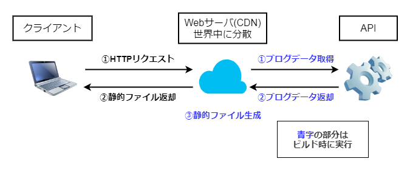
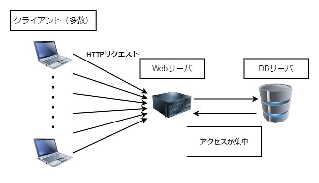
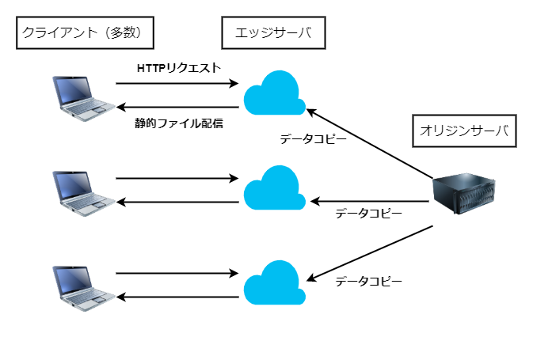

# Jamstackとはいったい何？

今回からは具体的に「Jamstackってなに？」「SSGやHeadlessCMSって？」ということを考えていきたいと思います。

まずこのページではJamstackとは何かについて、私なりの考えを述べたいと思います。

## 言葉の由来

JamstackのJamは「JavaScript」「APIs」「MarkUp」の頭文字を取った言葉です。要約すると、「JavaScriptでAPIを叩いて、静的なマークアップファイル（HTML、CSS、JavaScript）を配信するアーキテクチャ」だと言えます。

## 従来のWebサイトとの違い

Jamstackとは何かについて、従来のWebサイトの構成との違いから考えたいと思います。当サイトと同じようなブログを展開しているWebサイトを題材にします。

よくあるのは、①Webサーバ、②DBサーバを組み合わせた構成だと思います。ブログコンテンツ（記事のタイトルや本文、画像など）はDBサーバに保存、クライアントからのアクセスがあった時にWebサーバがHTMLファイルを作成、クライアントに返送するというパターンです。

また、このようにWebサーバ＋DBサーバをセットにしてWebサイトを構築できるように提供するサービスや仕組みをCMSなどと言ったりします。あの有名なWordpressがCMSの代表です。

では次にJamstackを考えます。Jamstackを構成するのは①Webサーバ（CDN）、②APIの2つです。

従来の仕組みでは「クライアントからのアクセスに応じてHTMLファイルを生成、クライアントに返送」していましたが、Jamstackでは「APIからデータを取得し静的サイトジェネレータ（SSG）を利用して事前にHTMLファイルを生成、クライアントに返送」する形になっています。APIは主にHeadlessCMSと呼ばれるマネジメントシステムを使って用意します。

## Jamstackを利用するメリット

### 高速なWebサイト表示

JamstackではCDNというサービスを使用して、SSGで出力した静的なファイルを配信します。

CDNとは何でしょう？ウィキペディアによると、

> コンテンツデリバリネットワークとは、ウェブコンテンツをインターネット経由で配信するために最適化されたネットワークのことである。コンテンツ配信網とも呼ばれる。

・・・とのことです。

これを一言で言うと「データをコピーした配信サーバを世界中に配置するネットワーク」です。

通常、WebサーバやDBサーバは一か所に固まって置かれていて、世界中からのアクセスを一手に引き受けています（冗長化であったりクラウドサービスを利用して分散させることはできますが、限界はありますしCDNの仕組みとは本質的に違います）。

CDNの場合、オリジンサーバ（これまででいうWebサーバ本体）から静的ファイルをコピーしたエッジサーバを世界中に分散し配置します。

クライアントはWebサイトにアクセスする際、オリジンサーバではなく物理的に近いエッジサーバからファイルをダウンロードすることになります。オリジンサーバに基本的に負荷はかかりません。エッジサーバにファイルをコピーする時だけですね。

また、エッジサーバの数は、CDNサービスにもよりますが数万台から数十万台とも言われており、「冗長構成」の比ではありません。これが世界中に物理的に分散されているのです。

事前に静的ファイルを生成するSSGと、このCDNという仕組みはとても相性がいいです。対して、バックエンドが介在するWebサイトでは「アクセスがあってからDBに処理を投げ、結果を見て静的ファイルを生成」するわけですから、基本的にCDNは利用しにくいです。

このサイトの場合ですと、AWS Amplifyを用いてCDNでの公開を行っています。

### サーバ負荷、管理コストが減る

従来の構成ではアクセスする度に動的にファイルを生成するため、Webサーバ、DBサーバにどうしても負荷がかかります。アクセスが集中するとサーバが落ちる可能性もでてきます。それに伴いCPUやメモリ、ディスク容量のリソース監視をずっと行っていく必要があります。

さらに、LinuxなどのサーバOS、ApacheやPHP、MySQLなどのミドルウェアの管理も必要です。加えてソフトウェアであるCMS自体のアップデートやプラグインの管理も必要であり、どうしても多くのランニングコストがかかります。

Jamstackならばどうでしょう。コンテンツ管理はHeadlessCMSを利用しAPIに集約されるため、DBをもちません。また、CDNを利用しているため自前でWebサーバを持たなくてよくなります。

アクセスが集中した時にサーバが落ちる云々はJamstackにも当てはまりますが、サーバが分散されているCDNの特徴からしてサーバが落ちることはそうそうないと思います。また、CDNはマネージド型サービスであることがほとんどですので、サーバ管理から解放されるという意味でもメリットです。

### 技術選択の幅が広がる

フロント（WebサーバやSSGなどのツール）とコンテンツ管理（API、HeadlessCMSなど）が疎結合になっているため、それぞれを分離して考えることができます。

例えばSSGなら「Gatsby、Next.js、Nuxt.js」という選択肢があり、HeadlessCMSも「microCMS、Contentful、graphCMS」があげられ、それぞれ好きな技術を組み合わせてサイトを構築することができます。